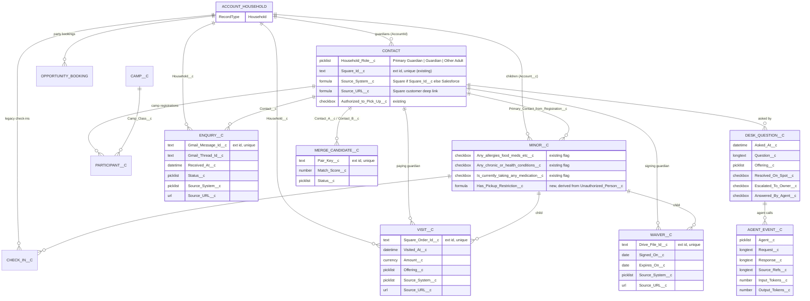

# Family Graph — ERD (v0.1, D02)

Tenant = one Salesforce org. Every fact is either native to the org (its record URL is the source_ref) or carries its source system's id plus Source_URL__c.

## Object map

| Graph concept | Salesforce object | New or existing | Source | Upsert key |
|---|---|---|---|---|
| Household | Account (RecordType Household) | existing object, new RT | Salesforce | Id |
| Guardian / adult | Contact | existing (+3 fields) | Square or Salesforce | Square_Id__c |
| Child | Minor__c | existing (+1 formula) | Salesforce | Id |
| Party booking | Opportunity (label "Booking") | existing | Salesforce | Booking_Reference__c |
| Camp registration | Participant__c → Camp__c | existing | Salesforce | Id |
| Legacy check-in | Check_In__c | existing | Salesforce | Id |
| Visit | Visit__c | new | Square | Square_Order_Id__c |
| Enquiry | Enquiry__c | new | Gmail | Gmail_Message_Id__c |
| Waiver | Waiver__c | new | Google Drive | Drive_File_Id__c |
| Desk tally | Desk_Question__c | new | Salesforce | Id |
| Identity review | Merge_Candidate__c | new | Salesforce (Apex batch) | Pair_Key__c |
| Agent audit | Agent_Event__c | new | agent runtime | Id |

## Provenance rule
- Visit__c, Enquiry__c, Waiver__c: validation rule Source_Refs_Required. Any Source_System__c other than Salesforce (including blank) needs Source_URL__c, and the system-specific id (Square_Order_Id__c, Gmail_Message_Id__c, Drive_File_Id__c).
- Contact: provenance is derived by formula from Square_Id__c, so all existing contacts are covered without backfill or changes to the Square sync.
- Native objects: the MCP server returns `{instanceUrl}/{Id}` as the source_ref.

## What agents can read (CommunityOS_Graph_Read)
Read-only with View All on the 13 graph objects. The following fields are **not** visible: Minor__c.Medical_Information__c, BC_Care_Card__c, Unauthorized_Person__c, Gender__c, vaccination and surgery fields; Contact Details_About_* and Medical_* notes; verification codes. Agents see the flags (allergy, medication, pickup restriction) and must send staff to the record for details.
